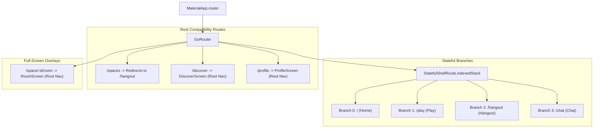

# ADDA v2.1 — Phase 1 Implementation Report
**Application Shell + 4-Branch Stateful Navigation**

**Date:** September 19, 2026  
**Status:** Completed & Verified  
**Baseline Test Status:** 39/39 Passing  
**Current Test Status:** 44/44 Passing (100% Success)  
**Analyzer Status:** 0 Errors / 0 Warnings  

---

## 1. Files Created

1. `lib/features/play/presentation/screens/play_screen.dart`
   - Dedicated Play domain entry point establishing the arcade experience.
   - Categorized game discovery (Card Classics, Party & Deception, Brain & Logic, Co-op Mystery).
   - Featured weekly hero banner showcasing 29 Cards.
   - Designed strictly using `DESIGN_SYSTEM.md` tokens (`AddaColors`, `AddaRadius`, `AddaSpacing`, `SurfaceCard`, `AppScaffold`).

2. `lib/features/hangout/presentation/screens/hangout_screen.dart`
   - Dedicated Hangout domain entry point establishing live social interaction.
   - Live activity indicator ("Who is here and what are they doing?").
   - Integrated Spaces list powered by `spacesProvider`, `SpaceCard`, filter chips, and entry points for `CreateSpaceSheet` and `JoinSpaceDialog`.

3. `lib/features/chat/presentation/screens/chat_screen.dart`
   - Independent Chat domain entry point.
   - Segmented conversation views (All Chats, Spaces, Game Invites).
   - Game invite indicators (`🎮 29 Cards`, `🎮 Court Piece`) deep-linking to sessions in future phases.

4. `test/navigation/shell_navigation_test.dart`
   - Automated widget test suite validating 4-branch switching, state preservation across branches, and compatibility routes.

---

## 2. Files Modified

1. `lib/app/router.dart`
   - Migrated legacy single `ShellRoute` to `StatefulShellRoute.indexedStack`.
   - Configured 4 stateful branches: `HOME`, `PLAY`, `HANGOUT`, `CHAT`.
   - Implemented `ScaffoldWithBottomNav` consuming `StatefulNavigationShell`.
   - Formatted bottom bar items with custom visual highlight for `PLAY`.
   - Maintained full-screen `_rootNavigatorKey` for `RoomScreen` (`/space/:id/room`).
   - Wired non-destructive compatibility routes (`/spaces`, `/discover`, `/profile`).

2. `lib/features/home/presentation/screens/home_screen.dart`
   - Updated the "View all" active spaces button from legacy `/spaces` to the new `/hangout` branch.

3. `test/widget_test.dart`
   - Updated the app boot widget test to assert the 4 new primary navigation destinations (`Home`, `Play`, `Hangout`, `Chat`).
   - Verified that `Profile` and `Discover` are no longer in the primary bottom navigation bar.

---

## 3. Files Preserved

- **All 12 Deterministic Game Engines**:
  - `lib/features/games/twenty_nine/`
  - `lib/features/games/uno/`
  - `lib/features/games/bluff/`
  - `lib/features/games/rummy/`
  - `lib/features/games/teen_patti/`
  - `lib/features/games/mafia/`
  - `lib/features/games/brain_arena/`
  - `lib/features/games/coop_puzzle/`
  - `lib/features/games/court_piece/`
  - `lib/features/games/couple_mode/`
  - `lib/features/games/pictionary/`
  - `lib/features/games/watch_together/`
- **Core Infrastructure Services**:
  - `StorageService` (`lib/core/storage/storage_service.dart`)
  - `SignalingService` (`lib/core/realtime/signaling_service.dart`)
  - `WebRtcService` (`lib/core/webrtc/webrtc_service.dart`)
  - Audio & Haptics services (`lib/core/audio/`, `lib/core/haptics/`)
- **Legacy Feature Code Preserved for Staged Migration**:
  - `lib/features/spaces/presentation/screens/spaces_screen.dart`
  - `lib/features/discover/presentation/screens/discover_screen.dart`
  - `lib/features/profile/presentation/screens/profile_screen.dart`
  - `lib/features/room/` (all Room controllers and presentation screens)

---

## 4. Routing Architecture



---

## 5. Navigation Structure

The primary bottom navigation bar is powered by `StatefulNavigationShell`:
1. **HOME** (`/`): Activity launcher, user greeting, quick action hero card, quick play carousel, active spaces list.
2. **PLAY** (`/play`): Game discovery arcade, featured weekly game, filterable categories (Card Classics, Party, Brain, Co-op), player count and duration indicators. Distinct energetic gradient badge styling.
3. **HANGOUT** (`/hangout`): Live social activity bar, SpaceType filter chips, Space cards list, Create/Join dialog entry points.
4. **CHAT** (`/chat`): Multi-channel conversation hub (All Chats, Spaces, Game Invites), unread counters, game challenge deep links.

---

## 6. Compatibility Routes Retained

| Path | Behavior | Target Component |
| :--- | :--- | :--- |
| `/spaces` | Redirect (`redirect: (context, state) => '/hangout'`) | Transitions seamlessly into the Hangout stateful branch |
| `/discover` | Standalone full-screen GoRoute | `DiscoverScreen` (preserves legacy activity launcher rules) |
| `/profile` | Standalone full-screen GoRoute | `ProfileScreen` (preserves settings/nickname edits until Phase 2) |
| `/space/:id/room` | Root Navigator GoRoute | `RoomScreen` (unmodified full-screen WebRTC room experience) |

---

## 7. Tests Added & Results

### Added Test Suite (`test/navigation/shell_navigation_test.dart`):
1. **4-branch navigation switches between Home, Play, Hangout, and Chat**: Confirms each tab is selectable and renders its respective screen.
2. **StatefulShellRoute preserves branch navigation and widget state**: Selects a filter on the Play screen, switches to Chat and Hangout, switches back to Play, and verifies filter selection state remains intact.
3. **Compatibility route `/profile` remains accessible via router**: Asserts `/profile` loads `ProfileScreen`.
4. **Compatibility route `/discover` remains accessible via router**: Asserts `/discover` loads `DiscoverScreen`.
5. **Compatibility route `/spaces` redirects to `/hangout`**: Asserts `/spaces` lands on `HangoutScreen`.

### Updated Test Suite (`test/widget_test.dart`):
- Updated app boot test to assert Home, Play, Hangout, Chat and verify absence of Profile and Discover from the bottom navigation.

---

## 8. Quality Gate Verification

### `flutter analyze`
```
Analyzing Adda_App...
No issues found! (ran in 3.0s)
```

### `flutter test`
```
00:08 +44: All tests passed!
```
- **Total Tests:** 44 (39 baseline + 5 new navigation tests)
- **Failures:** 0
- **Errors:** 0

---

## 9. Known Limitations

- **Solo Game Direct Launch**: Solo gameplay from the Play tab currently directs users to the Hangout/Space flow pending Phase 3 (Game Decoupling) and Phase 4 (BotPlayer & Solo Engines).
- **Chat Realtime Backend**: The Chat screen is an architectural domain foundation and preview mock; the messaging data store and WebSockets/P2P chat synchronization belong to Phase 8.
- **Profile Navigation**: Profile is removed from bottom navigation, accessible via route `/profile`; Phase 2 will introduce the `AddaTopBar` + `AddaIdentitySheet`.

---

## 10. Phase 2 Prerequisites

With the 4-branch stateful navigation shell fully verified and operational, the system is ready for **Phase 2: Guest Identity**:
1. Implement persistent local guest profile model (`guestId`, `displayName`, `avatarSeed`, `preferences`) in `StorageService`.
2. Introduce `AddaTopBar` across the application shell showing user avatar, online indicator, and notification badge.
3. Implement `AddaIdentitySheet` opened by tapping the user avatar on `AddaTopBar`, enabling nickname edits, theme toggle, and audio preferences without needing a separate bottom tab.
