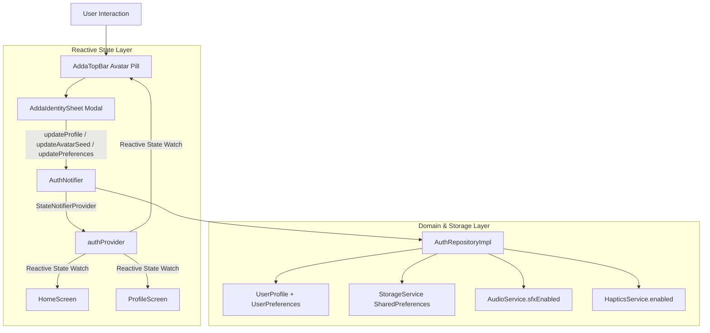

# ADDA v2.1 — Phase 2 Implementation Report
**Guest Identity + AddaTopBar + AddaIdentitySheet**

**Date:** September 20, 2026  
**Status:** Completed & Verified  
**Baseline Test Status:** 44/44 Passing  
**Current Test Status:** 58/58 Passing (100% Success)  
**Analyzer Status:** 0 Errors / 0 Warnings / Clean  
**Formatter Status:** Clean (`dart format --output=none --set-exit-if-changed .`)  

---

## 1. Files Created

1. `lib/shared/design_system/widgets/adda_top_bar.dart`
   - Reusable `PreferredSizeWidget` providing standard app bar functionality across the entire application shell.
   - Interactive guest identity pill on the left with `AppAvatar`, display name (flexibly truncated to avoid any overflow), and high-contrast `GUEST` badge.
   - Central brand context (`☕️ ADDA` pill or contextual `contextBadge` / `contextTitle` like `ARCADE Play Arena`, `LIVE Hangout`, `MESSAGES Chat`).
   - Dynamic right-side actions: live room indicator pill (`🟢 RoomName`) when connected to WebRTC/room session, plus quick identity/vibes sheet trigger.

2. `lib/features/profile/presentation/widgets/adda_identity_sheet.dart`
   - Tactile modal bottom sheet accessible by tapping the user avatar / identity pill from anywhere in the shell.
   - Full identity customization: display name editing with instant save and validation, copyable guest UUID (`usr_...`), and character avatar seed selection carousel.
   - Direct toggles for Theme Mode (Dark Mode Lounge), Haptic Feedback, and Sound Effects (SFX).
   - "Surprise Me" randomized avatar seed generator and quick action to regenerate guest identity.
   - Non-destructive link to full legacy `/profile` settings.

3. `test/features/auth/guest_identity_test.dart`
   - Comprehensive unit test suite covering guest provisioning, storage persistence, display name updates, avatar seed determinism, preferences persistence, serialization, and reactive `AuthNotifier` state transitions.

4. `test/features/auth/identity_ui_test.dart`
   - Widget test suite verifying `AddaTopBar` identity pill rendering, opening `AddaIdentitySheet`, display name editing and persistence, character preset selection, reactive preferences toggles, and `/profile` compatibility navigation.

---

## 2. Files Modified

1. `lib/features/auth/domain/models/user_profile.dart`
   - Extended `UserProfile` with `avatarSeed`, `UserPreferences` (`themeMode`, `soundEnabled`, `hapticsEnabled`, `reducedMotion`), and specification getter aliases (`guestUuid`, `displayName`).
   - Ensured backward and forward compatibility in `fromMap`, `toMap`, `fromJson`, and `toJson`.

2. `lib/features/auth/domain/repositories/auth_repository.dart`
   - Extended repository interface to accept optional `avatarSeed` and `preferences` in `createGuestUser` and `updateProfile`.

3. `lib/features/auth/data/auth_repository_impl.dart`
   - Updated guest identity creation to provision deterministic default avatar seeds from `defaultAvatarSeeds`.
   - Updated `getCurrentUser` to migrate legacy profiles to have an avatar seed and synchronized preferences.
   - Added automatic synchronization with `AudioService.sfxEnabled` and `HapticsService.enabled`.

4. `lib/features/auth/presentation/providers/auth_provider.dart`
   - Added `updateAvatarSeed(String seed)` and `updatePreferences(UserPreferences prefs)`.
   - Updated `updateProfile` and `regenerateGuest` signatures to propagate updates reactively.

5. `lib/shared/design_system/widgets/app_avatar.dart`
   - Added `avatarSeed` support.
   - Implemented deterministic visual representation: background colors derived from seed hash and character archetype emojis (`☕️`, `🐯`, `🦅`, `🎭`, `🚀`, `⚡️`, `🧙`, `🃏`, etc.) with fallback to initials.

6. `lib/features/profile/presentation/screens/profile_screen.dart`
   - Updated to consume `user.avatarSeed` in `AppAvatar`.
   - Updated preference switches to synchronize reactively with `authProvider.notifier.updatePreferences`.

7. `lib/features/home/presentation/screens/home_screen.dart`
   - Integrated `AddaTopBar` as the top-level app bar.
   - Refined the welcome sliver header to avoid duplicating the avatar now provided in the top bar.

8. `lib/features/play/presentation/screens/play_screen.dart`
   - Integrated `AddaTopBar(contextBadge: 'ARCADE', contextTitle: 'Play Arena')`.

9. `lib/features/hangout/presentation/screens/hangout_screen.dart`
   - Integrated `AddaTopBar(contextBadge: 'LIVE', contextTitle: 'Hangout', badgeColor: AddaColors.emerald, actions: [...])`.

10. `lib/features/chat/presentation/screens/chat_screen.dart`
    - Integrated `AddaTopBar(contextBadge: 'MESSAGES', contextTitle: 'Chat', actions: [...])`.

11. `test/features/room/room_provider_test.dart`
    - Updated `FakeAuthRepository` test double to implement the updated `AuthRepository` interface.

---

## 3. Identity Architecture



- **Frictionless Onboarding**: Fresh install automatically generates a unique `usr_<uuid>` ID, human-friendly handle (`PixelNomad`, `CosmicChai`, etc.), default avatar seed, and local preferences without login barriers.
- **Single Source of Truth**: Managed by Riverpod `authProvider` backed by `AuthRepositoryImpl` and persisted via `StorageService`.

---

## 4. Persistence Architecture

- **Engine**: Existing `StorageService` using `SharedPreferences` with graceful in-memory fallback for test harnesses and headless environments.
- **Key**: `adda_current_user_profile` storing full JSON payload.
- **Schema Evolution**: Handles existing and legacy profile JSON safely by defaulting missing keys (`avatarSeed`, `preferences`) on parse.
- **Service Sync**: Automatically applies `soundEnabled` to `AudioService.sfxEnabled` and `hapticsEnabled` to `HapticsService.enabled`.

---

## 5. AddaTopBar Architecture

- Implements Flutter's `PreferredSizeWidget` (`kToolbarHeight`).
- **Flexible Leading Pill**: Renders user avatar with deterministic archetype, user name in a flexible constraint with ellipsis, and `GUEST` badge. Guaranteed zero `RenderFlex` overflow even on narrow viewports.
- **Center**: Standardized brand badge (`☕️ ADDA`) or contextual screen badges (`ARCADE`, `LIVE`, `MESSAGES`).
- **Trailing Actions**: Automatically shows active WebRTC room connection status pill when `roomProvider != null` allowing 1-tap room restoration, alongside custom action icons or identity sheet trigger.

---

## 6. AddaIdentitySheet Architecture

- Modal bottom sheet invoked via `AddaIdentitySheet.show(context)`.
- **Character Preset Selection**: 8 curated character seeds (`seed_chai`, `seed_tiger`, `seed_phoenix`, `seed_bluff`, `seed_cosmic`, `seed_neon`, `seed_wizard`, `seed_joker`) plus "Surprise Me" randomizer.
- **Nickname Editing**: Real-time validation and reactive profile save with tactile success feedback.
- **Preferences**: In-place switches for Dark Mode Lounge, SFX audio, and card haptic feedback.
- **Identity Maintenance**: Copy guest UUID to clipboard, regenerate identity, or deep link to full settings.

---

## 7. Profile Compatibility Strategy

- `lib/features/profile/presentation/screens/profile_screen.dart` is preserved non-destructively.
- Router entry `/profile` remains registered in `appRouter`.
- `AddaIdentitySheet` contains a dedicated button to open `/profile` ("Full Settings").
- Both `AddaIdentitySheet` and `ProfileScreen` read and write to the same `authProvider` ensuring no split-brain state.

---

## 8. Automated Tests Added & Verification

### Unit Tests (`test/features/auth/guest_identity_test.dart`):
1. Guest identity is created with valid fields when none exists (`id`, `name`, `avatarSeed`, `preferences`).
2. Guest identity persists across reload and storage reinitialization.
3. Display name can be changed and persists to storage.
4. Avatar seed can be changed and persists to storage.
5. Preferences persist across storage re-reads.
6. `UserPreferences` serialization and deserialization retains integrity.
7. Identity provider updates reactively on profile changes (`name`, `avatarSeed`, `preferences`).
8. Regenerate guest produces new credentials and updates state.

### Widget Tests (`test/features/auth/identity_ui_test.dart`):
1. `AddaTopBar` renders guest name and GUEST badge.
2. Tapping identity pill opens `AddaIdentitySheet`.
3. `AddaIdentitySheet` allows editing and saving display name.
4. `AddaIdentitySheet` allows selecting avatar character preset.
5. `AddaIdentitySheet` toggles preferences reactively (haptics, sound, theme).
6. Full app shell boots and navigates to compatibility `/profile`.

---

## 9. Quality Gate Results

### `flutter analyze`
```
Analyzing Adda_App...
No issues found! (ran in 1.1s)
```

### `flutter test`
```
00:08 +58: All tests passed!
```
- **Baseline Tests:** 44 Passing
- **Phase 2 Tests Added:** 14 Passing
- **Total Tests Passing:** 58 Passing (100%)
- **Failures / Errors:** 0

### `dart format`
```
dart format --output=none --set-exit-if-changed .
All 117 files formatted cleanly.
```

---

## 10. Known Limitations

- **Cloud Backup**: Guest identity is strictly device-local; optional cloud backup and account linking are scheduled for a future release per `PRD.md`.
- **Flame Character Rig**: Avatar visual representation is currently rendered via deterministic emoji/color primitives (`AppAvatar`), establishing the data contract ahead of the Flame character presentation bridge (Phase 11).

---

## 11. Phase 3 Prerequisites

With Phase 2 verified and complete, the codebase satisfies all requirements for **Phase 3: Game Decoupling**:
1. `UserProfile` provides stable `guestUuid` and `displayName` needed for independent game player sessions.
2. `AddaTopBar` is unified across all branches and can render active decoupled game sessions without WebRTC coupling.
3. All 12 deterministic game engines remain completely intact and passing tests.
